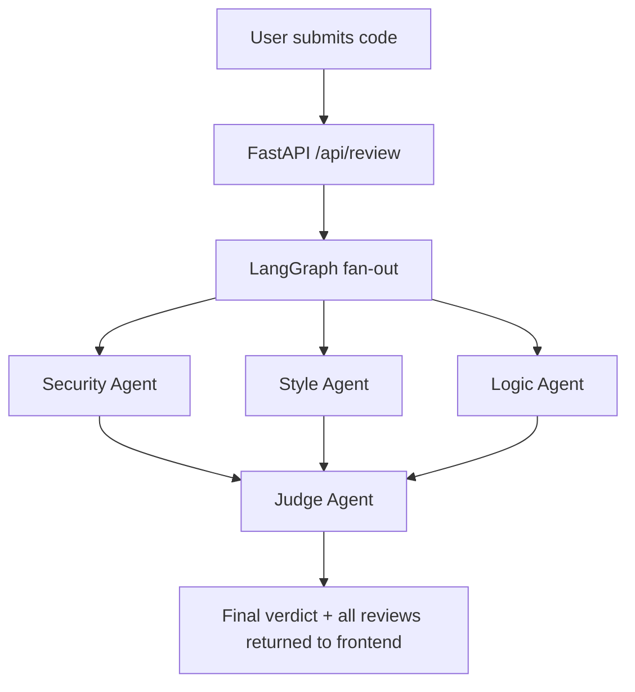

# CodeSentinel

CodeSentinel is an AI-powered code review tool that analyzes source code using multiple specialized agents running in parallel. Instead of relying on a single model to catch everything, the system splits the review into three focused perspectives — security, style, and logic — and then uses a fourth agent to synthesize their findings into one clear, actionable verdict.

Live demo: https://csentinel.vercel.app

## Overview

Reviewing code well means looking at it from more than one angle at the same time: Is it safe? Is it maintainable? Is it correct? Most AI code review tools try to answer all three questions with a single prompt, which tends to produce shallow, generic feedback.

CodeSentinel takes a different approach. It runs three independent agents in parallel, each with a narrow focus and its own prompt tuned for that focus. A fourth agent, the Judge, then reads all three reports and produces a single executive summary with an overall severity rating and a ship or do-not-ship recommendation.

The result is a review that is both fast (the three specialist agents run concurrently, not one after another) and more thorough than a single general-purpose prompt, because each agent only has to reason about one category of problem.

## Live Demo

The application is deployed and publicly accessible at:

https://csentinel.vercel.app

The frontend is a static site served from Vercel. The backend runs as a Vercel Python Function backed by the Groq API. There is no login or setup required to try it — paste any code snippet and click Analyze Code.

## How It Works

A code review request flows through the system as follows:

1. The user submits a code snippet and a language from the frontend.
2. The FastAPI backend receives the request and hands it to a LangGraph state graph.
3. The graph fans the request out to three agents at the same time: Security, Style, and Logic. Each agent receives the same code and language, but uses a different system prompt, so the three reviews happen concurrently rather than sequentially.
4. Once all three agents finish, their results are collected and passed to a fourth agent, the Judge.
5. The Judge reads all three reports, weighs their severities, and produces one final verdict: an executive summary, an overall severity level, and a recommendation.
6. The complete result — three individual reviews plus the final verdict — is returned to the frontend in a single response.



The fan-out and fan-in pattern is implemented with LangGraph's `Send` API, which allows the three specialist nodes to execute concurrently within a single graph invocation instead of being chained one after another. This is the main reason a full four-agent review typically completes in a few seconds rather than four separate round trips to the model.

## The Agents

### Security Agent

Looks at the code exclusively through the lens of security risk. It checks for injection vulnerabilities (SQL, command, XSS, SSRF), hardcoded secrets and credentials, use of unsafe functions such as `eval`, `exec`, or `os.system`, missing input validation, broken authentication or authorization logic, path traversal risks, weak cryptography, and sensitive data exposed in logs or responses.

### Style Agent

Focuses on maintainability and readability rather than correctness or safety. It looks for naming conventions that do not match the language's idioms, duplicated logic that should be extracted into a shared function, missing or unhelpful documentation, functions that are too long or too deeply nested, unexplained magic numbers, and inconsistent formatting.

### Logic Agent

Focuses on correctness. It looks for unhandled edge cases (empty input, zero, null, negative numbers), missing null checks, off-by-one errors, incorrect conditionals, infinite loops, race conditions, resource leaks such as unclosed files or connections, incorrect type assumptions, and swallowed exceptions.

### Judge Agent

Does not analyze the original code directly. Instead, it receives the findings from the Security, Style, and Logic agents and produces a single synthesized verdict: a short executive summary of the most important issues across all three reviews, an overall severity rating (the highest severity across the three reviews, weighted toward security issues), and a clear recommendation on whether the code is ready to ship, needs fixes first, or should not be shipped at all.

## Tech Stack

| Layer | Technology |
|---|---|
| LLM provider | Groq API (`llama-3.1-8b-instant`), with Ollama as a local fallback |
| Agent orchestration | LangGraph, using the `Send` API for parallel fan-out |
| LLM integration | LangChain (`langchain-groq`, `langchain-ollama`) |
| Backend framework | FastAPI on Python 3.12 |
| Data validation | Pydantic v2 |
| Frontend framework | React 19 with Vite |
| Styling | Tailwind CSS |
| Animation | Framer Motion, plus a hand-written canvas particle background |
| Deployment | Vercel (frontend as a static site, backend as a Python Function) |
| Local orchestration | Docker Compose |

## Project Structure

```
MultiAgentCodeReviewer/
├── backend/
│   ├── agents/
│   │   ├── security_agent.py    Security-focused review agent
│   │   ├── style_agent.py       Style and maintainability review agent
│   │   ├── logic_agent.py       Correctness and bug-focused review agent
│   │   ├── judge_agent.py       Synthesizes the three reviews into one verdict
│   │   └── llm.py               Chooses between Groq and Ollama based on configuration
│   ├── graph/
│   │   └── review_graph.py      LangGraph state graph wiring the fan-out and fan-in
│   ├── main.py                  FastAPI application and API routes
│   ├── models.py                Pydantic request and response schemas
│   ├── requirements.txt
│   └── Dockerfile
└── frontend/
    └── src/
        ├── components/
        │   ├── Background.jsx       Canvas-based particle and orb animation
        │   ├── CodeInput.jsx        Code editor panel with language selector
        │   └── ReviewResults.jsx    Agent chips, per-agent detail, and verdict card
        ├── hooks/
        │   └── useCodeReview.js     Request state and submission logic
        ├── utils/
        │   └── api.js               Fetch wrapper for the review API
        └── App.jsx                  Page layout: navigation, hero, and app shell
```

## Getting Started

### Prerequisites

- Python 3.12 or later
- Node.js 20 or later
- A free Groq API key from [console.groq.com](https://console.groq.com), or a local [Ollama](https://ollama.ai) installation

### Option A: Groq (cloud, recommended)

1. Create `backend/.env` with the following contents:

   ```
   GROQ_API_KEY=your_key_here
   LLM_PROVIDER=groq
   ```

2. Start the backend:

   ```
   cd backend
   python -m venv venv
   venv\Scripts\activate        (Windows)
   source venv/bin/activate     (macOS / Linux)

   pip install -r requirements.txt
   uvicorn main:app --reload --port 8000
   ```

3. Start the frontend in a separate terminal:

   ```
   cd frontend
   npm install
   npm run dev
   ```

4. Open [http://localhost:5173](http://localhost:5173).

### Option B: Ollama (local, no API key required)

1. Install Ollama and pull a model:

   ```
   ollama pull llama3
   ollama serve
   ```

2. Set the provider in `backend/.env`:

   ```
   LLM_PROVIDER=ollama
   GROQ_API_KEY=
   ```

3. Follow steps 2 through 4 from Option A.

### Option C: Docker Compose

```
# Add your GROQ_API_KEY to backend/.env first
docker compose up --build
```

Frontend: [http://localhost:5173](http://localhost:5173)
Backend: [http://localhost:8000](http://localhost:8000)

## API Reference

### `POST /api/review`

Submits code for a full multi-agent review.

Request body:

```json
{
  "code": "def hello(name):\n    print(f'Hello {name}')",
  "language": "python"
}
```

Response body:

```json
{
  "security_review": {
    "agent_name": "Security Agent",
    "findings": "No critical vulnerabilities found.",
    "severity": "LOW",
    "suggestions": ["Add input validation."]
  },
  "style_review": { "...": "same shape as security_review" },
  "logic_review": { "...": "same shape as security_review" },
  "final_verdict": "Executive summary text.",
  "overall_severity": "LOW",
  "duration_ms": 1842.3
}
```

Severity is always one of `LOW`, `MEDIUM`, or `HIGH`.

### `GET /api/health`

Returns a simple status check:

```json
{ "status": "ok", "service": "CodeSentinel" }
```

## Deployment

The application is deployed as two separate Vercel projects:

- **Frontend** (`csentinel.vercel.app`) — the Vite build output, served as a static site. A `vercel.json` rewrite forwards any request to `/api/*` to the backend project, so the browser only ever talks to a single origin and no CORS configuration is required on the client side.
- **Backend** (`codesentinel-api.vercel.app`) — the FastAPI application, deployed as a Vercel Python Function. Vercel automatically detects the `app` instance exported from `backend/main.py` and the dependencies listed in `backend/requirements.txt`. The Groq API key is stored as a Vercel environment variable rather than committed to the repository.

To redeploy either half of the application:

```
cd backend && vercel deploy --prod
cd frontend && vercel deploy --prod
```

## Environment Variables

| Variable | Description |
|---|---|
| `GROQ_API_KEY` | API key for Groq. Required when `LLM_PROVIDER` is `groq`. |
| `LLM_PROVIDER` | Either `groq` or `ollama`. Defaults to `groq` if unset. |

A `backend/.env.example` file is included as a template. Never commit a real API key — `backend/.env` is git-ignored.

## Screenshots

Screenshots will be added here.

## License

This project is provided as-is for personal and educational use.
